# Architecture Specification - Trello Pro

## 1. System Overview

### 1.1 Architecture Pattern
Trello Pro follows a **monolithic Next.js architecture** with server-side rendering and API routes.

### 1.2 Technology Stack

```mermaid
graph TB
    subgraph "Frontend Layer"
        A[Next.js 15 App Router]
        B[React Components]
        C[shadcn/ui]
        D[@dnd-kit]
    end

    subgraph "Backend Layer"
        E[Next.js API Routes]
        F[NextAuth]
        G[Server Actions]
    end

    subgraph "Data Layer"
        H[Drizzle ORM]
        I[SQLite Database]
    end

    subgraph "External Services"
        J[Google OAuth]
    end

    A --> B
    B --> C
    B --> D
    A --> E
    A --> G
    E --> F
    F --> J
    E --> H
    G --> H
    H --> I
```

## 2. System Architecture

### 2.1 High-Level Architecture

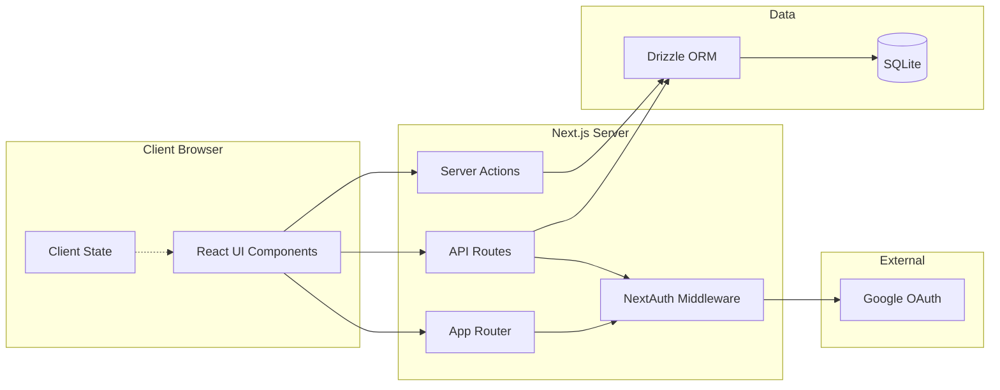

### 2.2 Layer Responsibilities

#### Frontend Layer
- **Responsibility**: User interface, client-side state, user interactions
- **Components**:
  - React components (pages, UI components)
  - Client-side routing (Next.js App Router)
  - State management (React hooks, Context API)
  - Drag & drop interactions (@dnd-kit)
  - UI library (shadcn/ui)

#### Backend Layer
- **Responsibility**: Business logic, authentication, data access
- **Components**:
  - API routes (REST endpoints)
  - Server actions (form submissions, mutations)
  - NextAuth (authentication/authorization)
  - Middleware (auth checks, request validation)

#### Data Layer
- **Responsibility**: Data persistence, queries, migrations
- **Components**:
  - Drizzle ORM (type-safe queries)
  - SQLite database (local file storage)
  - Migration management (Drizzle Kit)

## 3. Component Architecture

### 3.1 Application Structure

```
src/
├── app/                    # Next.js 15 App Router
│   ├── (auth)/
│   │   └── login/          # Login page
│   ├── (dashboard)/
│   │   ├── page.tsx        # Board list (/)
│   │   └── board/
│   │       └── [id]/       # Board detail (/board/[id])
│   ├── api/                # API routes
│   │   ├── auth/           # NextAuth
│   │   ├── boards/         # Board endpoints
│   │   ├── lists/          # List endpoints
│   │   ├── cards/          # Card endpoints
│   │   ├── labels/         # Label endpoints (P1)
│   │   └── members/        # Member endpoints (P2)
│   └── layout.tsx          # Root layout
├── components/             # React components
│   ├── ui/                 # shadcn/ui base components
│   ├── board/              # Board-related components
│   ├── card/               # Card-related components
│   ├── sidebar/            # Side panel components
│   └── shared/             # Shared components
├── lib/                    # Utilities
│   ├── db/                 # Drizzle schema & queries
│   ├── auth.ts             # NextAuth config
│   └── utils.ts            # Helper functions
└── types/                  # TypeScript types
```

### 3.2 Component Hierarchy

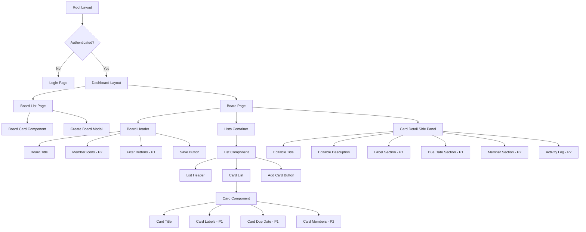

## 4. Data Flow Architecture

### 4.1 Authentication Flow

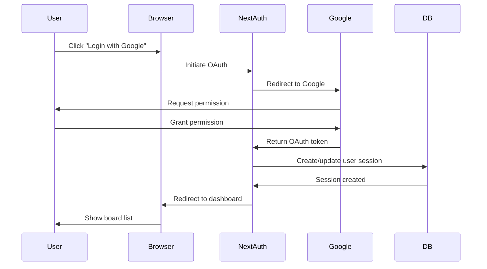

### 4.2 Board Creation Flow

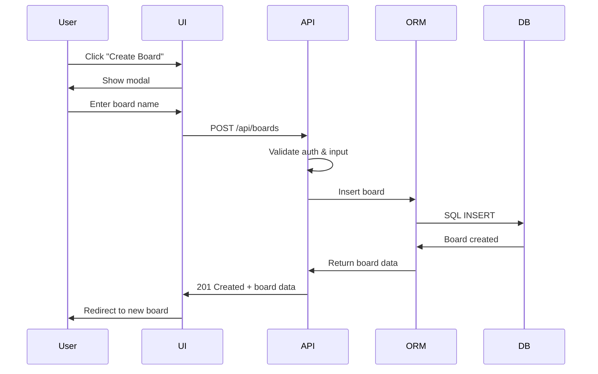

### 4.3 Card Drag & Drop Flow

```mermaid
sequenceDiagram
    participant User
    participant DnD[@dnd-kit]
    participant State[Client State]
    participant API
    participant DB

    User->>DnD: Drag card
    DnD->>State: Optimistic update
    State->>User: Show new position
    User->>DnD: Drop card
    DnD->>State: Finalize position
    State->>API: PATCH /api/cards/[id]
    API->>DB: Update position & listId
    DB->>API: Success
    API->>State: Confirm update

    Note over State,API: If API fails, rollback to previous state
```

### 4.4 Real-Time Update Strategy (Manual Save)

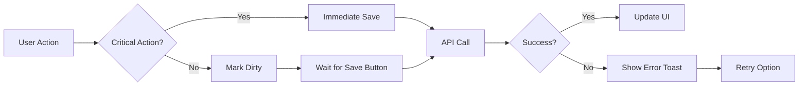

**Critical Actions** (auto-save):
- Board create/delete
- List create/delete
- Card create/delete

**Non-Critical Actions** (manual save):
- Title/description edits
- Label changes
- Due date changes
- Position changes (after drag & drop)

## 5. API Architecture

### 5.1 API Routes Structure

```
/api/
├── auth/
│   └── [...nextauth]/      # NextAuth handlers
├── boards/
│   ├── GET                 # List boards
│   ├── POST                # Create board
│   └── [id]/
│       ├── GET             # Get board details
│       ├── PATCH           # Update board
│       └── DELETE          # Delete board
├── lists/
│   ├── POST                # Create list
│   └── [id]/
│       ├── PATCH           # Update list
│       └── DELETE          # Delete list
├── cards/
│   ├── POST                # Create card
│   └── [id]/
│       ├── GET             # Get card details
│       ├── PATCH           # Update card
│       └── DELETE          # Delete card
├── labels/                 # P1
│   ├── GET                 # List labels for board
│   ├── POST                # Create label
│   └── [id]/
│       ├── PATCH           # Update label
│       └── DELETE          # Delete label
└── members/                # P2
    ├── POST                # Invite member
    └── [id]/
        └── DELETE          # Remove member
```

### 5.2 API Response Format

**Success Response:**
```json
{
  "success": true,
  "data": { ... }
}
```

**Error Response:**
```json
{
  "success": false,
  "error": {
    "code": "VALIDATION_ERROR",
    "message": "User-friendly message",
    "details": { ... }
  }
}
```

## 6. State Management

### 6.1 State Architecture

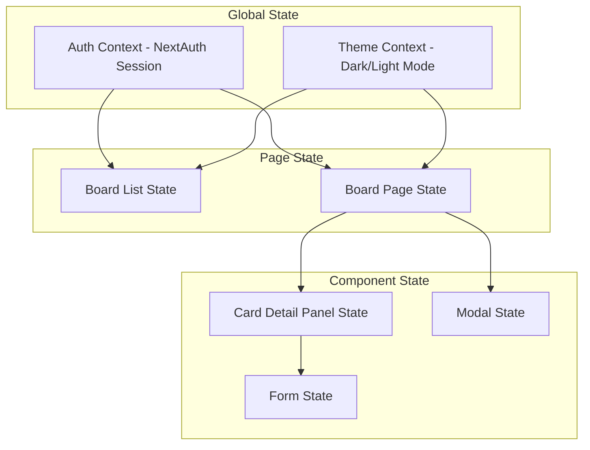

### 6.2 State Management Strategy

| Scope | Method | Example |
|-------|--------|---------|
| Global | React Context | Auth session, theme preference |
| Server | Server Components | Initial data fetching |
| Page | useState + useEffect | Board data, lists, cards |
| Component | useState | Modal open/close, form inputs |
| Form | React Hook Form | Card edit form, board creation |

### 6.3 Data Fetching Strategy

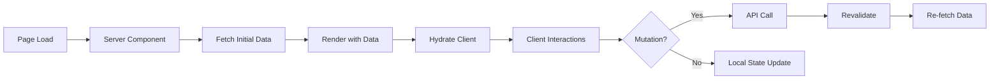

## 7. Security Architecture

### 7.1 Authentication & Authorization

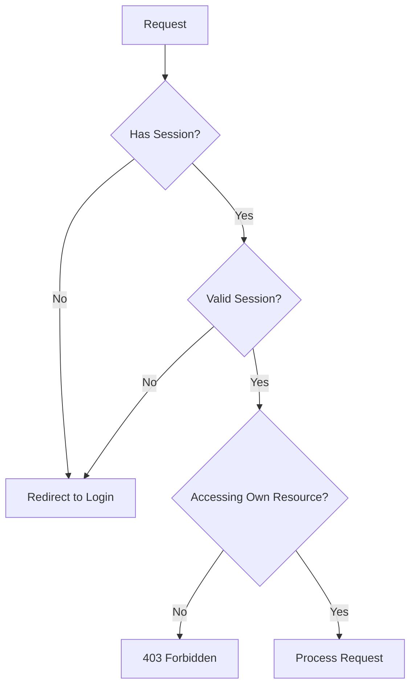

### 7.2 Security Layers

1. **Authentication Layer** (NextAuth Middleware)
   - Verify session on all protected routes
   - Refresh expired tokens

2. **Authorization Layer** (API Routes)
   - Check resource ownership
   - Validate board/card access permissions

3. **Input Validation Layer**
   - Sanitize all user inputs
   - Validate against schema (Zod)

4. **Database Layer**
   - Parameterized queries (Drizzle ORM)
   - No raw SQL from user input

## 8. Testing Architecture

### 8.1 Testing Strategy

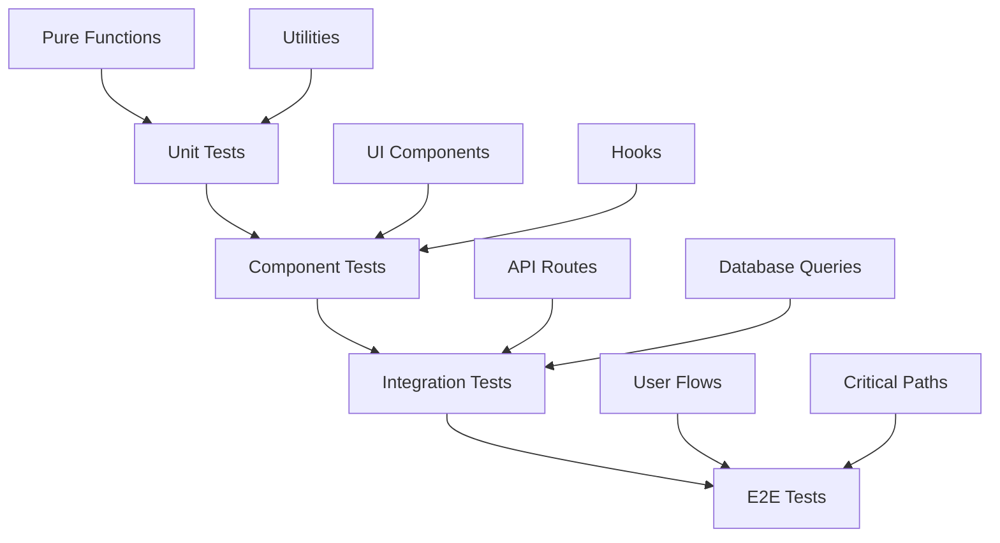

### 8.2 E2E Test Coverage (Playwright)

**P0 Test Scenarios:**
1. User login flow
2. Create board → Add list → Add card
3. Drag & drop card between lists
4. Edit card details
5. Delete card/list/board

**P1 Test Scenarios:**
6. Add label to card
7. Filter by label
8. Set due date
9. Sort by due date

**P2 Test Scenarios:**
10. Invite member
11. Assign member to card
12. View activity log

## 9. Performance Architecture

### 9.1 Optimization Strategies

| Layer | Strategy | Implementation |
|-------|----------|----------------|
| Frontend | Code splitting | Next.js automatic code splitting |
| Frontend | Image optimization | Next.js Image component |
| Frontend | Lazy loading | React.lazy for modals/panels |
| Backend | Database indexing | Index on foreign keys, user queries |
| Backend | Query optimization | Select only needed fields |
| Caching | Static generation | Board list, public pages |
| Caching | Client-side cache | React Query / SWR (optional) |

### 9.2 Performance Monitoring

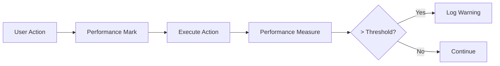

**Key Metrics:**
- Time to Interactive (TTI) < 2s
- First Contentful Paint (FCP) < 1s
- Drag & drop frame rate = 60 FPS
- API response time < 100ms

## 10. Deployment Architecture

### 10.1 Local Development

```
Developer Machine
├── Node.js Runtime
├── Next.js Dev Server (Port 3000)
├── SQLite DB File (local.db)
└── Environment Variables (.env.local)
```

### 10.2 Build Process

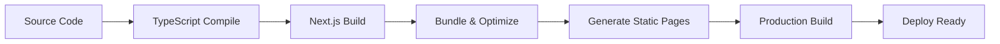

## 11. Error Handling Architecture

### 11.1 Error Propagation

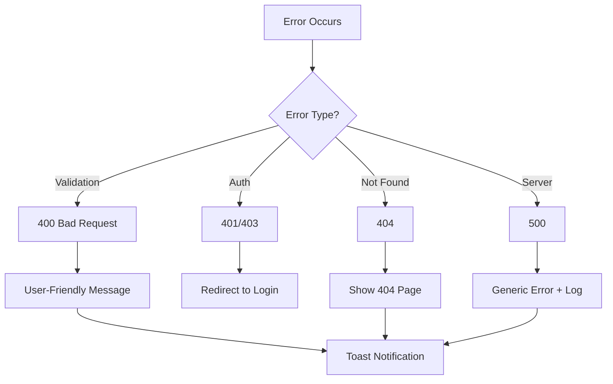

### 11.2 Error Boundaries

- **Page-level**: Catch errors in entire page
- **Component-level**: Catch errors in card panel, modals
- **Fallback UI**: Show user-friendly error message with retry option

## 12. Scalability Considerations

### 12.1 Current Limitations
- SQLite write concurrency limited
- No horizontal scaling (monolithic)
- No distributed caching

### 12.2 Future Migration Path
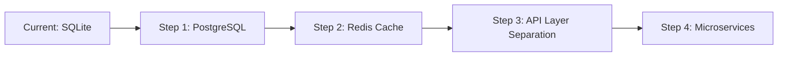

This architecture is designed for **current scope** (local, single-user focus) with **extensibility** for future growth.
