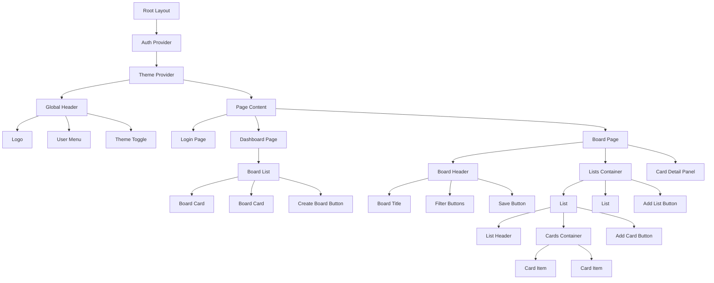

# Component Specification - Trello Pro

## 1. Overview

### 1.1 Component Architecture
- **Framework**: React with Next.js 15 App Router
- **Language**: TypeScript
- **UI Library**: shadcn/ui
- **Styling**: Tailwind CSS
- **Drag & Drop**: @dnd-kit

### 1.2 Component Organization

```
src/components/
├── ui/                     # shadcn/ui base components
│   ├── button.tsx
│   ├── input.tsx
│   ├── card.tsx
│   ├── dialog.tsx
│   ├── dropdown-menu.tsx
│   ├── popover.tsx
│   ├── toast.tsx
│   └── ...
├── board/                  # Board-related components
│   ├── board-header.tsx
│   ├── board-list.tsx
│   ├── board-card.tsx
│   ├── create-board-modal.tsx
│   └── board-settings.tsx
├── list/                   # List components
│   ├── list.tsx
│   ├── list-header.tsx
│   ├── add-list.tsx
│   └── list-options.tsx
├── card/                   # Card components
│   ├── card.tsx
│   ├── card-item.tsx
│   ├── add-card.tsx
│   └── card-labels.tsx
├── sidebar/                # Side panel components
│   ├── card-detail-panel.tsx
│   ├── card-description.tsx
│   ├── card-labels-section.tsx (P1)
│   ├── card-due-date-section.tsx (P1)
│   ├── card-members-section.tsx (P2)
│   └── card-activity-section.tsx (P2)
├── label/                  # Label components (P1)
│   ├── label-badge.tsx
│   ├── label-picker.tsx
│   └── label-manager.tsx
├── member/                 # Member components (P2)
│   ├── member-avatar.tsx
│   ├── member-picker.tsx
│   └── invite-member-modal.tsx
└── shared/                 # Shared/common components
    ├── header.tsx
    ├── theme-toggle.tsx
    ├── user-menu.tsx
    └── loading-spinner.tsx
```

## 2. Component Tree



## 3. Core Components (P0)

### 3.1 Layout Components

#### RootLayout
**File**: `src/app/layout.tsx`

**Purpose**: Global application layout with providers.

**Props**: None (layout component)

**Children**:
- `AuthProvider` (NextAuth session provider)
- `ThemeProvider` (Dark mode provider)

**Example**:
```tsx
export default function RootLayout({ children }: { children: React.ReactNode }) {
  return (
    <html lang="en" suppressHydrationWarning>
      <body>
        <AuthProvider>
          <ThemeProvider>
            {children}
          </ThemeProvider>
        </AuthProvider>
      </body>
    </html>
  );
}
```

---

#### Header
**File**: `src/components/shared/header.tsx`

**Purpose**: Global navigation header.

**Props**:
```typescript
interface HeaderProps {
  showBackButton?: boolean;
  backHref?: string;
}
```

**State**: None

**Features**:
- Logo (links to dashboard)
- User menu (profile, logout)
- Theme toggle
- Optional back button

**Example**:
```tsx
<Header showBackButton backHref="/dashboard" />
```

---

### 3.2 Authentication Components

#### LoginPage
**File**: `src/app/(auth)/login/page.tsx`

**Purpose**: Google OAuth login page.

**Props**: None (page component)

**State**: None

**Features**:
- "Sign in with Google" button
- Redirects to dashboard on success

**Example**:
```tsx
export default function LoginPage() {
  return (
    <div className="flex min-h-screen items-center justify-center">
      <Card className="w-[400px] p-6">
        <h1>Welcome to Trello Pro</h1>
        <Button onClick={() => signIn('google')}>
          Sign in with Google
        </Button>
      </Card>
    </div>
  );
}
```

---

### 3.3 Board List Components

#### BoardListPage
**File**: `src/app/(dashboard)/page.tsx`

**Purpose**: Display all user boards.

**Props**: None (page component)

**State**:
```typescript
const [boards, setBoards] = useState<Board[]>([]);
const [isCreateModalOpen, setIsCreateModalOpen] = useState(false);
```

**Features**:
- Grid of board cards
- "Create Board" button
- Loading state

**Example**:
```tsx
<div className="grid grid-cols-1 md:grid-cols-3 gap-4">
  {boards.map(board => (
    <BoardCard key={board.id} board={board} />
  ))}
  <CreateBoardButton onClick={() => setIsCreateModalOpen(true)} />
</div>
```

---

#### BoardCard
**File**: `src/components/board/board-card.tsx`

**Purpose**: Individual board card in list.

**Props**:
```typescript
interface BoardCardProps {
  board: Board;
}

interface Board {
  id: string;
  title: string;
  background?: string;
  updatedAt: Date;
  cardCount?: number;
}
```

**State**: None

**Features**:
- Click to navigate to board
- Show board name, background, card count, last updated
- Hover effect

**Example**:
```tsx
<BoardCard
  board={{
    id: '1',
    title: 'My Project',
    background: '#3b82f6',
    updatedAt: new Date(),
    cardCount: 12
  }}
/>
```

---

#### CreateBoardModal
**File**: `src/components/board/create-board-modal.tsx`

**Purpose**: Modal for creating new board.

**Props**:
```typescript
interface CreateBoardModalProps {
  open: boolean;
  onClose: () => void;
  onSuccess: (board: Board) => void;
}
```

**State**:
```typescript
const [title, setTitle] = useState('');
const [background, setBackground] = useState('');
const [isLoading, setIsLoading] = useState(false);
```

**Features**:
- Text input for board name
- Background color picker
- Create/Cancel buttons
- Validation (1-100 chars)

**Example**:
```tsx
<CreateBoardModal
  open={isOpen}
  onClose={() => setIsOpen(false)}
  onSuccess={(board) => {
    setBoards([...boards, board]);
    setIsOpen(false);
  }}
/>
```

---

### 3.4 Board Page Components

#### BoardPage
**File**: `src/app/(dashboard)/board/[id]/page.tsx`

**Purpose**: Main board view with lists and cards.

**Props**:
```typescript
interface BoardPageProps {
  params: { id: string };
}
```

**State**:
```typescript
const [board, setBoard] = useState<BoardWithLists | null>(null);
const [selectedCard, setSelectedCard] = useState<Card | null>(null);
const [isDirty, setIsDirty] = useState(false);
```

**Features**:
- Fetch and display board data
- Horizontal scrolling lists
- Drag & drop enabled
- Side panel for card details
- Save button

**Example**:
```tsx
<div className="flex h-screen flex-col">
  <BoardHeader board={board} onSave={handleSave} isDirty={isDirty} />
  <ListsContainer lists={board.lists} onCardClick={setSelectedCard} />
  {selectedCard && (
    <CardDetailPanel card={selectedCard} onClose={() => setSelectedCard(null)} />
  )}
</div>
```

---

#### BoardHeader
**File**: `src/components/board/board-header.tsx`

**Purpose**: Board header with title and actions.

**Props**:
```typescript
interface BoardHeaderProps {
  board: Board;
  isDirty: boolean;
  onSave: () => void;
  onTitleChange: (title: string) => void;
}
```

**State**:
```typescript
const [isEditingTitle, setIsEditingTitle] = useState(false);
```

**Features**:
- Editable board title (click to edit)
- Save button (highlighted if isDirty)
- Board settings dropdown
- Filter buttons (P1)
- Member icons (P2)

**Example**:
```tsx
<BoardHeader
  board={board}
  isDirty={isDirty}
  onSave={handleSave}
  onTitleChange={(title) => updateBoard({ title })}
/>
```

---

### 3.5 List Components

#### List
**File**: `src/components/list/list.tsx`

**Purpose**: Container for cards (workflow column).

**Props**:
```typescript
interface ListProps {
  list: List;
  cards: Card[];
  onAddCard: (title: string) => void;
  onCardClick: (card: Card) => void;
  onUpdateList: (updates: Partial<List>) => void;
  onDeleteList: () => void;
}
```

**State**:
```typescript
const [isAddingCard, setIsAddingCard] = useState(false);
```

**Features**:
- List header with title
- Scrollable card container
- "Add card" button
- Drag & drop enabled

**Example**:
```tsx
<List
  list={list}
  cards={cardsInList}
  onAddCard={handleAddCard}
  onCardClick={setSelectedCard}
  onUpdateList={handleUpdateList}
  onDeleteList={handleDeleteList}
/>
```

---

#### ListHeader
**File**: `src/components/list/list-header.tsx`

**Purpose**: List title and actions.

**Props**:
```typescript
interface ListHeaderProps {
  list: List;
  onUpdateTitle: (title: string) => void;
  onDelete: () => void;
}
```

**State**:
```typescript
const [isEditing, setIsEditing] = useState(false);
const [title, setTitle] = useState(list.title);
```

**Features**:
- Click to edit title
- Options dropdown (delete list)

**Example**:
```tsx
<ListHeader
  list={list}
  onUpdateTitle={(title) => updateList({ title })}
  onDelete={handleDelete}
/>
```

---

#### AddList
**File**: `src/components/list/add-list.tsx`

**Purpose**: Button/form to add new list.

**Props**:
```typescript
interface AddListProps {
  boardId: string;
  onSuccess: (list: List) => void;
}
```

**State**:
```typescript
const [isAdding, setIsAdding] = useState(false);
const [title, setTitle] = useState('');
```

**Features**:
- Button shows "Add List"
- Click to show input form
- Cancel/Add buttons

**Example**:
```tsx
<AddList
  boardId={boardId}
  onSuccess={(list) => setLists([...lists, list])}
/>
```

---

### 3.6 Card Components

#### CardItem
**File**: `src/components/card/card-item.tsx`

**Purpose**: Individual card in list (summary view).

**Props**:
```typescript
interface CardItemProps {
  card: Card;
  onClick: () => void;
  isDragging?: boolean;
}

interface Card {
  id: string;
  title: string;
  description?: string;
  dueDate?: Date;
  labels?: Label[]; // P1
  members?: User[]; // P2
}
```

**State**: None

**Features**:
- Card title
- Labels (colored badges) - P1
- Due date indicator with color coding - P1
- Member avatars - P2
- Drag handle

**Example**:
```tsx
<CardItem
  card={{
    id: '1',
    title: 'Implement login',
    dueDate: new Date('2026-02-10'),
    labels: [{ id: '1', name: 'Feature', color: 'blue' }]
  }}
  onClick={() => setSelectedCard(card)}
/>
```

---

#### AddCard
**File**: `src/components/card/add-card.tsx`

**Purpose**: Button/form to add new card to list.

**Props**:
```typescript
interface AddCardProps {
  listId: string;
  onSuccess: (card: Card) => void;
}
```

**State**:
```typescript
const [isAdding, setIsAdding] = useState(false);
const [title, setTitle] = useState('');
```

**Features**:
- Button shows "Add Card"
- Click to show textarea
- Cancel/Add buttons

**Example**:
```tsx
<AddCard
  listId={listId}
  onSuccess={(card) => setCards([...cards, card])}
/>
```

---

### 3.7 Card Detail Panel (Side Panel)

#### CardDetailPanel
**File**: `src/components/sidebar/card-detail-panel.tsx`

**Purpose**: Side panel showing full card details.

**Props**:
```typescript
interface CardDetailPanelProps {
  card: Card;
  onClose: () => void;
  onUpdate: (updates: Partial<Card>) => void;
  onDelete: () => void;
}
```

**State**:
```typescript
const [localCard, setLocalCard] = useState(card);
```

**Features**:
- Editable title
- Editable description (textarea)
- Labels section (P1)
- Due date section (P1)
- Members section (P2)
- Activity log (P2)
- Delete button
- Close button (X)

**Layout**:
- Fixed position on right side
- Overlay background
- Scrollable content
- Closes on ESC or outside click

**Example**:
```tsx
<CardDetailPanel
  card={selectedCard}
  onClose={() => setSelectedCard(null)}
  onUpdate={handleUpdateCard}
  onDelete={handleDeleteCard}
/>
```

---

#### CardDescription
**File**: `src/components/sidebar/card-description.tsx`

**Purpose**: Editable description field in card detail.

**Props**:
```typescript
interface CardDescriptionProps {
  description: string;
  onSave: (description: string) => void;
}
```

**State**:
```typescript
const [isEditing, setIsEditing] = useState(false);
const [text, setText] = useState(description);
```

**Features**:
- Click to edit (shows textarea)
- Save/Cancel buttons
- Markdown preview (optional enhancement)

---

### 3.8 Shared Components

#### ThemeToggle
**File**: `src/components/shared/theme-toggle.tsx`

**Purpose**: Toggle between light/dark mode.

**Props**: None

**State**:
```typescript
const { theme, setTheme } = useTheme();
```

**Features**:
- Button with sun/moon icon
- Toggles theme
- Persists to localStorage

**Example**:
```tsx
<ThemeToggle />
```

---

#### UserMenu
**File**: `src/components/shared/user-menu.tsx`

**Purpose**: User profile dropdown.

**Props**:
```typescript
interface UserMenuProps {
  user: User;
}
```

**State**:
```typescript
const [isOpen, setIsOpen] = useState(false);
```

**Features**:
- User avatar (clickable)
- Dropdown menu: Profile, Logout

**Example**:
```tsx
<UserMenu user={session.user} />
```

---

## 4. Label Components (P1)

### 4.1 LabelBadge
**File**: `src/components/label/label-badge.tsx`

**Purpose**: Display colored label badge.

**Props**:
```typescript
interface LabelBadgeProps {
  label: Label;
  onClick?: () => void;
  removable?: boolean;
  onRemove?: () => void;
}

interface Label {
  id: string;
  name: string;
  color: string;
}
```

**Features**:
- Colored background based on label color
- Optional click handler (for filtering)
- Optional X button (for removal)

**Example**:
```tsx
<LabelBadge
  label={{ id: '1', name: 'Bug', color: 'red' }}
  removable
  onRemove={() => removeLabel(label.id)}
/>
```

---

### 4.2 LabelPicker
**File**: `src/components/label/label-picker.tsx`

**Purpose**: Popover for selecting labels.

**Props**:
```typescript
interface LabelPickerProps {
  boardId: string;
  selectedLabels: string[]; // Label IDs
  onToggle: (labelId: string) => void;
}
```

**State**:
```typescript
const [labels, setLabels] = useState<Label[]>([]);
const [isCreating, setIsCreating] = useState(false);
```

**Features**:
- List of available labels with checkboxes
- Click label to toggle selection
- "Create new label" button
- Search/filter labels

**Example**:
```tsx
<Popover>
  <PopoverTrigger asChild>
    <Button variant="outline">Labels</Button>
  </PopoverTrigger>
  <PopoverContent>
    <LabelPicker
      boardId={boardId}
      selectedLabels={card.labelIds}
      onToggle={handleToggleLabel}
    />
  </PopoverContent>
</Popover>
```

---

### 4.3 CardLabelsSection
**File**: `src/components/sidebar/card-labels-section.tsx`

**Purpose**: Labels section in card detail panel.

**Props**:
```typescript
interface CardLabelsSectionProps {
  card: Card;
  onUpdate: (labelIds: string[]) => void;
}
```

**Features**:
- Display current labels as badges
- "Add label" button (opens LabelPicker)
- Remove label by clicking X on badge

---

## 5. Due Date Components (P1)

### 5.1 CardDueDateSection
**File**: `src/components/sidebar/card-due-date-section.tsx`

**Purpose**: Due date section in card detail panel.

**Props**:
```typescript
interface CardDueDateSectionProps {
  dueDate?: Date;
  onUpdate: (dueDate: Date | null) => void;
}
```

**State**:
```typescript
const [isPickerOpen, setIsPickerOpen] = useState(false);
```

**Features**:
- Display current due date with color coding
- Date picker (calendar)
- "Remove due date" button

**Color Coding**:
- Green: > 2 days remaining
- Yellow: 1-2 days remaining
- Red: < 24 hours or overdue

**Example**:
```tsx
<CardDueDateSection
  dueDate={card.dueDate}
  onUpdate={(date) => updateCard({ dueDate: date })}
/>
```

---

## 6. Member Components (P2)

### 6.1 MemberAvatar
**File**: `src/components/member/member-avatar.tsx`

**Purpose**: Display user avatar.

**Props**:
```typescript
interface MemberAvatarProps {
  user: User;
  size?: 'sm' | 'md' | 'lg';
  onClick?: () => void;
}

interface User {
  id: string;
  name: string;
  image?: string;
}
```

**Features**:
- Show user image or initials fallback
- Configurable size
- Optional click handler

**Example**:
```tsx
<MemberAvatar
  user={{ id: '1', name: 'John Doe', image: 'https://...' }}
  size="sm"
/>
```

---

### 6.2 MemberPicker
**File**: `src/components/member/member-picker.tsx`

**Purpose**: Popover for assigning members to card.

**Props**:
```typescript
interface MemberPickerProps {
  boardId: string;
  assignedMembers: string[]; // User IDs
  onToggle: (userId: string) => void;
}
```

**State**:
```typescript
const [members, setMembers] = useState<User[]>([]);
```

**Features**:
- List of board members with checkboxes
- Click to toggle assignment
- Search members

---

### 6.3 CardMembersSection
**File**: `src/components/sidebar/card-members-section.tsx`

**Purpose**: Members section in card detail panel.

**Props**:
```typescript
interface CardMembersSectionProps {
  card: Card;
  onUpdate: (memberIds: string[]) => void;
}
```

**Features**:
- Display assigned members as avatars
- "Add member" button (opens MemberPicker)
- Remove member by clicking X

---

### 6.4 InviteMemberModal
**File**: `src/components/member/invite-member-modal.tsx`

**Purpose**: Modal for inviting new member to board.

**Props**:
```typescript
interface InviteMemberModalProps {
  boardId: string;
  open: boolean;
  onClose: () => void;
  onSuccess: () => void;
}
```

**State**:
```typescript
const [email, setEmail] = useState('');
const [isLoading, setIsLoading] = useState(false);
```

**Features**:
- Email input
- Invite button (sends email)
- Email validation

---

## 7. Activity Components (P2)

### 7.1 CardActivitySection
**File**: `src/components/sidebar/card-activity-section.tsx`

**Purpose**: Activity log in card detail panel.

**Props**:
```typescript
interface CardActivitySectionProps {
  cardId: string;
}
```

**State**:
```typescript
const [activities, setActivities] = useState<Activity[]>([]);
```

**Features**:
- List activities chronologically (newest first)
- Each activity shows: user avatar, action, timestamp
- Format action text (e.g., "John moved this card from To Do to In Progress")

**Example**:
```tsx
<CardActivitySection cardId={card.id} />
```

---

### 7.2 ActivityItem
**File**: `src/components/sidebar/activity-item.tsx`

**Purpose**: Single activity entry.

**Props**:
```typescript
interface ActivityItemProps {
  activity: Activity;
}

interface Activity {
  id: string;
  user: User;
  action: string;
  details: any;
  createdAt: Date;
}
```

**Features**:
- User avatar
- Formatted action text
- Relative timestamp (e.g., "2 hours ago")

---

## 8. Drag & Drop Components

### 8.1 DnD Setup
Using `@dnd-kit` library for drag and drop.

**Context Providers**:
```tsx
<DndContext sensors={sensors} onDragEnd={handleDragEnd}>
  <SortableContext items={listIds} strategy={horizontalListSortingStrategy}>
    {/* Lists */}
  </SortableContext>
</DndContext>
```

---

### 8.2 Draggable List
**File**: `src/components/list/list.tsx` (with useSortable)

**Features**:
- Drag handle on list header
- Horizontal reordering

**Example**:
```tsx
const { attributes, listeners, setNodeRef, transform } = useSortable({ id: list.id });

<div ref={setNodeRef} style={transform ? { transform: `translate3d(${transform.x}px, 0, 0)` } : undefined}>
  <div {...attributes} {...listeners}>
    <ListHeader />
  </div>
  {/* Cards */}
</div>
```

---

### 8.3 Draggable Card
**File**: `src/components/card/card-item.tsx` (with useSortable)

**Features**:
- Entire card is draggable
- Can move within list or to other lists

**Example**:
```tsx
const { attributes, listeners, setNodeRef, transform, isDragging } = useSortable({ id: card.id });

<div
  ref={setNodeRef}
  {...attributes}
  {...listeners}
  style={{ transform: CSS.Transform.toString(transform), opacity: isDragging ? 0.5 : 1 }}
>
  <CardItem card={card} />
</div>
```

---

## 9. Form Components

### 9.1 Form Validation
Using `react-hook-form` with `zod` for validation.

**Example Schema**:
```typescript
const boardSchema = z.object({
  title: z.string().min(1).max(100),
  background: z.string().optional(),
});
```

**Form Usage**:
```tsx
const form = useForm<BoardFormValues>({
  resolver: zodResolver(boardSchema),
});
```

---

## 10. Component Patterns

### 10.1 Server Components vs Client Components
- **Server Components**: Pages, initial data fetching
- **Client Components**: Interactive UI, forms, modals

**Convention**:
```tsx
// Server component (default)
export default async function BoardPage({ params }: { params: { id: string } }) {
  const board = await getBoard(params.id);
  return <BoardClientWrapper board={board} />;
}

// Client component
'use client';
export function BoardClientWrapper({ board }: { board: Board }) {
  // Client-side state and interactions
}
```

---

### 10.2 Optimistic Updates
For better UX, update UI immediately and rollback on error.

**Example**:
```tsx
const handleUpdateCard = async (updates: Partial<Card>) => {
  const previous = card;
  setCard({ ...card, ...updates }); // Optimistic update

  try {
    await updateCardAPI(card.id, updates);
  } catch (error) {
    setCard(previous); // Rollback on error
    toast.error('Failed to update card');
  }
};
```

---

### 10.3 Loading States
Use `<Suspense>` boundaries for loading states.

**Example**:
```tsx
<Suspense fallback={<LoadingSpinner />}>
  <BoardContent />
</Suspense>
```

---

### 10.4 Error Boundaries
Wrap components in error boundaries for graceful error handling.

**Example**:
```tsx
<ErrorBoundary fallback={<ErrorMessage />}>
  <CardDetailPanel />
</ErrorBoundary>
```

---

## 11. Component Testing

### 11.1 Unit Tests (Optional)
Test individual components in isolation using React Testing Library.

**Example**:
```tsx
test('BoardCard renders correctly', () => {
  render(<BoardCard board={mockBoard} />);
  expect(screen.getByText('My Board')).toBeInTheDocument();
});
```

---

### 11.2 E2E Tests (Playwright)
Test user flows end-to-end.

**Example**:
```typescript
test('User can create and view a card', async ({ page }) => {
  await page.goto('/board/1');
  await page.click('text=Add Card');
  await page.fill('textarea', 'New task');
  await page.click('text=Add');
  await expect(page.locator('text=New task')).toBeVisible();
});
```

---

## 12. Performance Optimization

### 12.1 Memoization
Use `React.memo`, `useMemo`, `useCallback` for expensive components.

**Example**:
```tsx
const CardItem = React.memo(({ card, onClick }: CardItemProps) => {
  // Component code
});
```

---

### 12.2 Virtualization (Future Enhancement)
For lists with many cards, use virtualization library like `react-virtual`.

---

### 12.3 Code Splitting
Lazy load heavy components (modals, panels).

**Example**:
```tsx
const CardDetailPanel = lazy(() => import('./card-detail-panel'));

<Suspense fallback={<LoadingSpinner />}>
  {selectedCard && <CardDetailPanel card={selectedCard} />}
</Suspense>
```

---

## 13. Accessibility

### 13.1 Keyboard Navigation
- Tab through interactive elements
- Enter to activate buttons/links
- ESC to close modals/panels
- Arrow keys for drag & drop (alternative to mouse)

### 13.2 ARIA Labels
Add proper ARIA labels for screen readers.

**Example**:
```tsx
<button aria-label="Delete card">
  <TrashIcon />
</button>
```

### 13.3 Focus Management
Manage focus when opening/closing modals.

**Example**:
```tsx
useEffect(() => {
  if (isOpen) {
    inputRef.current?.focus();
  }
}, [isOpen]);
```

---

This component specification provides a complete blueprint for building all UI components in the Trello Pro application.
