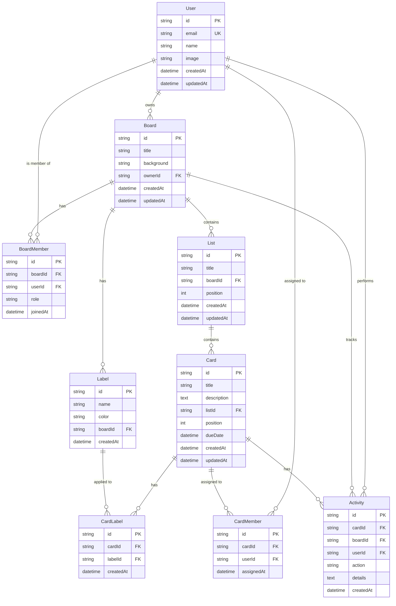

# Database Specification - Trello Pro

## 1. Overview

### 1.1 Database Technology
- **Database**: SQLite
- **ORM**: Drizzle ORM
- **Migration Tool**: Drizzle Kit
- **File Location**: `./local.db` (development), configurable for production

### 1.2 Design Principles
- Normalized schema (3NF) to minimize redundancy
- Foreign key constraints for referential integrity
- Indexes on frequently queried columns
- Timestamps for audit trail
- Soft delete NOT implemented (hard delete for simplicity)

## 2. Entity Relationship Diagram



## 3. Schema Definitions

### 3.1 User Table

**Purpose**: Store authenticated user information from Google OAuth.

| Column | Type | Constraints | Description |
|--------|------|-------------|-------------|
| id | TEXT | PRIMARY KEY | UUID v4 |
| email | TEXT | NOT NULL, UNIQUE | User's Google email |
| name | TEXT | NOT NULL | User's display name |
| image | TEXT | | Profile photo URL from Google |
| createdAt | INTEGER | NOT NULL, DEFAULT now | Unix timestamp (ms) |
| updatedAt | INTEGER | NOT NULL, DEFAULT now | Unix timestamp (ms) |

**Indexes:**
- Primary key on `id`
- Unique index on `email`

**Drizzle Schema:**
```typescript
export const users = sqliteTable('users', {
  id: text('id').primaryKey().$defaultFn(() => crypto.randomUUID()),
  email: text('email').notNull().unique(),
  name: text('name').notNull(),
  image: text('image'),
  createdAt: integer('created_at', { mode: 'timestamp' }).notNull().$defaultFn(() => new Date()),
  updatedAt: integer('updated_at', { mode: 'timestamp' }).notNull().$defaultFn(() => new Date()),
});
```

### 3.2 Board Table

**Purpose**: Store project boards owned by users.

| Column | Type | Constraints | Description |
|--------|------|-------------|-------------|
| id | TEXT | PRIMARY KEY | UUID v4 |
| title | TEXT | NOT NULL | Board name (1-100 chars) |
| background | TEXT | | Color hex or image URL |
| ownerId | TEXT | NOT NULL, FK → users(id) | Board owner |
| createdAt | INTEGER | NOT NULL, DEFAULT now | Unix timestamp (ms) |
| updatedAt | INTEGER | NOT NULL, DEFAULT now | Unix timestamp (ms) |

**Indexes:**
- Primary key on `id`
- Index on `ownerId` (frequent query: "get all boards for user")
- Index on `updatedAt` (for sorting by recent activity)

**Foreign Keys:**
- `ownerId` REFERENCES `users(id)` ON DELETE CASCADE

**Drizzle Schema:**
```typescript
export const boards = sqliteTable('boards', {
  id: text('id').primaryKey().$defaultFn(() => crypto.randomUUID()),
  title: text('title').notNull(),
  background: text('background'),
  ownerId: text('owner_id').notNull().references(() => users.id, { onDelete: 'cascade' }),
  createdAt: integer('created_at', { mode: 'timestamp' }).notNull().$defaultFn(() => new Date()),
  updatedAt: integer('updated_at', { mode: 'timestamp' }).notNull().$defaultFn(() => new Date()),
}, (table) => ({
  ownerIdx: index('boards_owner_idx').on(table.ownerId),
  updatedIdx: index('boards_updated_idx').on(table.updatedAt),
}));
```

### 3.3 BoardMember Table (P2)

**Purpose**: Many-to-many relationship for board members.

| Column | Type | Constraints | Description |
|--------|------|-------------|-------------|
| id | TEXT | PRIMARY KEY | UUID v4 |
| boardId | TEXT | NOT NULL, FK → boards(id) | Board reference |
| userId | TEXT | NOT NULL, FK → users(id) | Member reference |
| role | TEXT | NOT NULL, DEFAULT 'member' | 'owner' or 'member' |
| joinedAt | INTEGER | NOT NULL, DEFAULT now | Unix timestamp (ms) |

**Indexes:**
- Primary key on `id`
- Composite unique index on `(boardId, userId)` (prevent duplicate membership)
- Index on `userId` (query: "get all boards for user")

**Foreign Keys:**
- `boardId` REFERENCES `boards(id)` ON DELETE CASCADE
- `userId` REFERENCES `users(id)` ON DELETE CASCADE

**Drizzle Schema:**
```typescript
export const boardMembers = sqliteTable('board_members', {
  id: text('id').primaryKey().$defaultFn(() => crypto.randomUUID()),
  boardId: text('board_id').notNull().references(() => boards.id, { onDelete: 'cascade' }),
  userId: text('user_id').notNull().references(() => users.id, { onDelete: 'cascade' }),
  role: text('role').notNull().default('member'), // 'owner' | 'member'
  joinedAt: integer('joined_at', { mode: 'timestamp' }).notNull().$defaultFn(() => new Date()),
}, (table) => ({
  boardUserIdx: uniqueIndex('board_members_board_user_idx').on(table.boardId, table.userId),
  userIdx: index('board_members_user_idx').on(table.userId),
}));
```

### 3.4 List Table

**Purpose**: Store workflow stages (columns) within a board.

| Column | Type | Constraints | Description |
|--------|------|-------------|-------------|
| id | TEXT | PRIMARY KEY | UUID v4 |
| title | TEXT | NOT NULL | List name (1-100 chars) |
| boardId | TEXT | NOT NULL, FK → boards(id) | Parent board |
| position | INTEGER | NOT NULL | Display order (0-based) |
| createdAt | INTEGER | NOT NULL, DEFAULT now | Unix timestamp (ms) |
| updatedAt | INTEGER | NOT NULL, DEFAULT now | Unix timestamp (ms) |

**Indexes:**
- Primary key on `id`
- Composite index on `(boardId, position)` (frequent query: "get lists for board ordered by position")

**Foreign Keys:**
- `boardId` REFERENCES `boards(id)` ON DELETE CASCADE

**Drizzle Schema:**
```typescript
export const lists = sqliteTable('lists', {
  id: text('id').primaryKey().$defaultFn(() => crypto.randomUUID()),
  title: text('title').notNull(),
  boardId: text('board_id').notNull().references(() => boards.id, { onDelete: 'cascade' }),
  position: integer('position').notNull(),
  createdAt: integer('created_at', { mode: 'timestamp' }).notNull().$defaultFn(() => new Date()),
  updatedAt: integer('updated_at', { mode: 'timestamp' }).notNull().$defaultFn(() => new Date()),
}, (table) => ({
  boardPosIdx: index('lists_board_pos_idx').on(table.boardId, table.position),
}));
```

### 3.5 Card Table

**Purpose**: Store individual tasks/items within lists.

| Column | Type | Constraints | Description |
|--------|------|-------------|-------------|
| id | TEXT | PRIMARY KEY | UUID v4 |
| title | TEXT | NOT NULL | Card title (1-200 chars) |
| description | TEXT | | Markdown-supported description |
| listId | TEXT | NOT NULL, FK → lists(id) | Parent list |
| position | INTEGER | NOT NULL | Display order within list (0-based) |
| dueDate | INTEGER | | Due date (Unix timestamp, nullable) |
| createdAt | INTEGER | NOT NULL, DEFAULT now | Unix timestamp (ms) |
| updatedAt | INTEGER | NOT NULL, DEFAULT now | Unix timestamp (ms) |

**Indexes:**
- Primary key on `id`
- Composite index on `(listId, position)` (query: "get cards for list ordered by position")
- Index on `dueDate` (for sorting/filtering by due date)

**Foreign Keys:**
- `listId` REFERENCES `lists(id)` ON DELETE CASCADE

**Drizzle Schema:**
```typescript
export const cards = sqliteTable('cards', {
  id: text('id').primaryKey().$defaultFn(() => crypto.randomUUID()),
  title: text('title').notNull(),
  description: text('description'),
  listId: text('list_id').notNull().references(() => lists.id, { onDelete: 'cascade' }),
  position: integer('position').notNull(),
  dueDate: integer('due_date', { mode: 'timestamp' }),
  createdAt: integer('created_at', { mode: 'timestamp' }).notNull().$defaultFn(() => new Date()),
  updatedAt: integer('updated_at', { mode: 'timestamp' }).notNull().$defaultFn(() => new Date()),
}, (table) => ({
  listPosIdx: index('cards_list_pos_idx').on(table.listId, table.position),
  dueDateIdx: index('cards_due_date_idx').on(table.dueDate),
}));
```

### 3.6 Label Table (P1)

**Purpose**: Store color-coded labels for card categorization.

| Column | Type | Constraints | Description |
|--------|------|-------------|-------------|
| id | TEXT | PRIMARY KEY | UUID v4 |
| name | TEXT | NOT NULL | Label name (1-50 chars) |
| color | TEXT | NOT NULL | Hex color code or predefined color name |
| boardId | TEXT | NOT NULL, FK → boards(id) | Parent board (labels are board-scoped) |
| createdAt | INTEGER | NOT NULL, DEFAULT now | Unix timestamp (ms) |

**Indexes:**
- Primary key on `id`
- Index on `boardId` (query: "get all labels for board")

**Foreign Keys:**
- `boardId` REFERENCES `boards(id)` ON DELETE CASCADE

**Predefined Colors:**
`red`, `orange`, `yellow`, `green`, `blue`, `purple`, `pink`, `gray`, `brown`, `black`

**Drizzle Schema:**
```typescript
export const labels = sqliteTable('labels', {
  id: text('id').primaryKey().$defaultFn(() => crypto.randomUUID()),
  name: text('name').notNull(),
  color: text('color').notNull(), // Predefined color name
  boardId: text('board_id').notNull().references(() => boards.id, { onDelete: 'cascade' }),
  createdAt: integer('created_at', { mode: 'timestamp' }).notNull().$defaultFn(() => new Date()),
}, (table) => ({
  boardIdx: index('labels_board_idx').on(table.boardId),
}));
```

### 3.7 CardLabel Table (P1)

**Purpose**: Many-to-many relationship between cards and labels.

| Column | Type | Constraints | Description |
|--------|------|-------------|-------------|
| id | TEXT | PRIMARY KEY | UUID v4 |
| cardId | TEXT | NOT NULL, FK → cards(id) | Card reference |
| labelId | TEXT | NOT NULL, FK → labels(id) | Label reference |
| createdAt | INTEGER | NOT NULL, DEFAULT now | Unix timestamp (ms) |

**Indexes:**
- Primary key on `id`
- Composite unique index on `(cardId, labelId)` (prevent duplicate label assignment)
- Index on `labelId` (query: "get all cards with this label")

**Foreign Keys:**
- `cardId` REFERENCES `cards(id)` ON DELETE CASCADE
- `labelId` REFERENCES `labels(id)` ON DELETE CASCADE

**Drizzle Schema:**
```typescript
export const cardLabels = sqliteTable('card_labels', {
  id: text('id').primaryKey().$defaultFn(() => crypto.randomUUID()),
  cardId: text('card_id').notNull().references(() => cards.id, { onDelete: 'cascade' }),
  labelId: text('label_id').notNull().references(() => labels.id, { onDelete: 'cascade' }),
  createdAt: integer('created_at', { mode: 'timestamp' }).notNull().$defaultFn(() => new Date()),
}, (table) => ({
  cardLabelIdx: uniqueIndex('card_labels_card_label_idx').on(table.cardId, table.labelId),
  labelIdx: index('card_labels_label_idx').on(table.labelId),
}));
```

### 3.8 CardMember Table (P2)

**Purpose**: Many-to-many relationship for card member assignments.

| Column | Type | Constraints | Description |
|--------|------|-------------|-------------|
| id | TEXT | PRIMARY KEY | UUID v4 |
| cardId | TEXT | NOT NULL, FK → cards(id) | Card reference |
| userId | TEXT | NOT NULL, FK → users(id) | Assigned member |
| assignedAt | INTEGER | NOT NULL, DEFAULT now | Unix timestamp (ms) |

**Indexes:**
- Primary key on `id`
- Composite unique index on `(cardId, userId)` (prevent duplicate assignment)
- Index on `userId` (query: "get all cards assigned to user")

**Foreign Keys:**
- `cardId` REFERENCES `cards(id)` ON DELETE CASCADE
- `userId` REFERENCES `users(id)` ON DELETE CASCADE

**Drizzle Schema:**
```typescript
export const cardMembers = sqliteTable('card_members', {
  id: text('id').primaryKey().$defaultFn(() => crypto.randomUUID()),
  cardId: text('card_id').notNull().references(() => cards.id, { onDelete: 'cascade' }),
  userId: text('user_id').notNull().references(() => users.id, { onDelete: 'cascade' }),
  assignedAt: integer('assigned_at', { mode: 'timestamp' }).notNull().$defaultFn(() => new Date()),
}, (table) => ({
  cardUserIdx: uniqueIndex('card_members_card_user_idx').on(table.cardId, table.userId),
  userIdx: index('card_members_user_idx').on(table.userId),
}));
```

### 3.9 Activity Table (P2)

**Purpose**: Audit log for tracking all changes to boards and cards.

| Column | Type | Constraints | Description |
|--------|------|-------------|-------------|
| id | TEXT | PRIMARY KEY | UUID v4 |
| cardId | TEXT | FK → cards(id), NULLABLE | Related card (null for board-level actions) |
| boardId | TEXT | NOT NULL, FK → boards(id) | Related board |
| userId | TEXT | NOT NULL, FK → users(id) | User who performed action |
| action | TEXT | NOT NULL | Action type (see below) |
| details | TEXT | | JSON string with action details |
| createdAt | INTEGER | NOT NULL, DEFAULT now | Unix timestamp (ms) |

**Action Types:**
- `card_created`, `card_updated`, `card_deleted`, `card_moved`
- `list_created`, `list_updated`, `list_deleted`, `list_moved`
- `label_added`, `label_removed`
- `due_date_set`, `due_date_changed`, `due_date_removed`
- `member_assigned`, `member_unassigned`

**Indexes:**
- Primary key on `id`
- Index on `boardId` (query: "get all activity for board")
- Index on `cardId` (query: "get all activity for card")
- Index on `createdAt` (for chronological sorting)

**Foreign Keys:**
- `cardId` REFERENCES `cards(id)` ON DELETE CASCADE
- `boardId` REFERENCES `boards(id)` ON DELETE CASCADE
- `userId` REFERENCES `users(id)` ON DELETE SET NULL

**Drizzle Schema:**
```typescript
export const activities = sqliteTable('activities', {
  id: text('id').primaryKey().$defaultFn(() => crypto.randomUUID()),
  cardId: text('card_id').references(() => cards.id, { onDelete: 'cascade' }),
  boardId: text('board_id').notNull().references(() => boards.id, { onDelete: 'cascade' }),
  userId: text('user_id').notNull().references(() => users.id, { onDelete: 'set null' }),
  action: text('action').notNull(),
  details: text('details'), // JSON string
  createdAt: integer('created_at', { mode: 'timestamp' }).notNull().$defaultFn(() => new Date()),
}, (table) => ({
  boardIdx: index('activities_board_idx').on(table.boardId),
  cardIdx: index('activities_card_idx').on(table.cardId),
  createdIdx: index('activities_created_idx').on(table.createdAt),
}));
```

## 4. Common Queries

### 4.1 Get All Boards for User
```typescript
const userBoards = await db
  .select()
  .from(boards)
  .where(eq(boards.ownerId, userId))
  .orderBy(desc(boards.updatedAt));
```

### 4.2 Get Board with Lists and Cards
```typescript
const board = await db.query.boards.findFirst({
  where: eq(boards.id, boardId),
  with: {
    lists: {
      orderBy: [asc(lists.position)],
      with: {
        cards: {
          orderBy: [asc(cards.position)],
          with: {
            labels: { with: { label: true } },
            members: { with: { user: true } },
          },
        },
      },
    },
  },
});
```

### 4.3 Get Card Details
```typescript
const card = await db.query.cards.findFirst({
  where: eq(cards.id, cardId),
  with: {
    labels: { with: { label: true } },
    members: { with: { user: true } },
    activities: {
      orderBy: [desc(activities.createdAt)],
      with: { user: true },
    },
  },
});
```

### 4.4 Move Card to Different List
```typescript
await db.transaction(async (tx) => {
  // Update card's listId and position
  await tx
    .update(cards)
    .set({ listId: newListId, position: newPosition })
    .where(eq(cards.id, cardId));

  // Log activity
  await tx.insert(activities).values({
    cardId,
    boardId,
    userId,
    action: 'card_moved',
    details: JSON.stringify({ from: oldListId, to: newListId }),
  });
});
```

### 4.5 Filter Cards by Label
```typescript
const cardsWithLabel = await db
  .select()
  .from(cards)
  .innerJoin(cardLabels, eq(cards.id, cardLabels.cardId))
  .where(eq(cardLabels.labelId, labelId));
```

### 4.6 Get Cards Assigned to User
```typescript
const userCards = await db
  .select()
  .from(cards)
  .innerJoin(cardMembers, eq(cards.id, cardMembers.cardId))
  .where(eq(cardMembers.userId, userId));
```

## 5. Migrations

### 5.1 Migration Strategy
- Use Drizzle Kit for generating and running migrations
- Migrations stored in `drizzle/` directory
- Each migration is a sequential SQL file

### 5.2 Migration Commands
```bash
# Generate migration
npx drizzle-kit generate:sqlite

# Run migrations
npx drizzle-kit push:sqlite

# Drop database (development only)
npx drizzle-kit drop
```

### 5.3 Initial Migration (P0 - MVP)
```sql
-- Create tables: users, boards, lists, cards
-- Indexes for performance
```

### 5.4 P1 Migration
```sql
-- Add tables: labels, card_labels
-- Indexes for label queries
```

### 5.5 P2 Migration
```sql
-- Add tables: board_members, card_members, activities
-- Indexes for member and activity queries
```

## 6. Database Constraints & Rules

### 6.1 Cascading Deletes
- Delete board → cascade delete lists, cards, labels, members, activities
- Delete list → cascade delete cards
- Delete label → cascade delete card_labels
- Delete user → cascade delete boards owned, set null on activities

### 6.2 Position Management
- Positions are 0-based integers
- When inserting: assign max(position) + 1
- When reordering: update positions atomically in transaction
- No gaps required (can have 0, 1, 2, 3...)

### 6.3 Data Validation (Application Layer)
- Title lengths enforced in API validation (not DB constraints)
- Email format validation
- Color value validation (must be in predefined list)
- Date validation for dueDate

## 7. Performance Considerations

### 7.1 Indexing Strategy
All foreign keys are indexed to optimize JOIN operations.

### 7.2 Query Optimization
- Use `SELECT` with specific columns instead of `SELECT *`
- Limit results with pagination for large datasets
- Use transactions for multi-step operations

### 7.3 Connection Pooling
SQLite doesn't support connection pooling, but Drizzle handles single connection efficiently.

## 8. Backup & Recovery

### 8.1 Backup Strategy
SQLite database is a single file (`local.db`), making backup simple:
```bash
# Backup
cp local.db backup/local-$(date +%Y%m%d).db

# Restore
cp backup/local-20260205.db local.db
```

### 8.2 Export/Import
```bash
# Export to SQL
sqlite3 local.db .dump > backup.sql

# Import from SQL
sqlite3 new.db < backup.sql
```

## 9. Testing Data

### 9.1 Seed Data Script
Create seed data for development/testing:
```typescript
// scripts/seed.ts
const seedUser = await db.insert(users).values({
  email: 'test@example.com',
  name: 'Test User',
});

const seedBoard = await db.insert(boards).values({
  title: 'Sample Project',
  ownerId: seedUser.id,
});

// ... seed lists, cards, labels
```

### 9.2 Test Database
Use separate SQLite file for testing:
```typescript
// test.config.ts
const testDbPath = './test.db';
```
